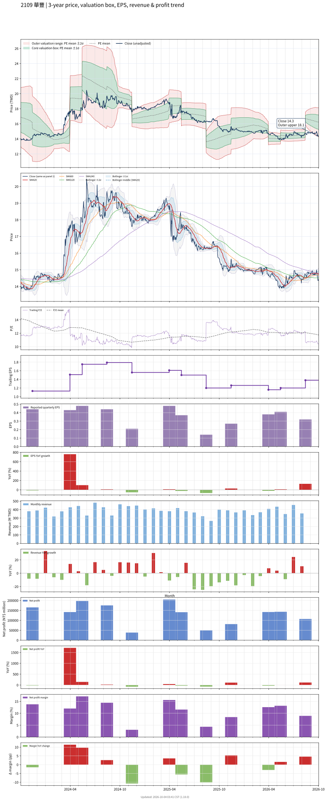

# 2109 - 華豐

## 業務簡介
**板塊:** Consumer Cyclical
**產業:** Auto Parts
**市值:** 4,009 百萬台幣
**企業價值:** 5,666 百萬台幣

華豐橡膠 (2109，Hwa Fong Rubber) 創立於 1945 年，為台灣最早之輪胎廠，自有品牌[[DURO]]。營收結構以機車胎 (50%+) 及自行車胎 (20%+) 為主。[[住友橡膠]] (Sumitomo Rubber) 自 1979 年起進行資本與技術合作，為重要策略夥伴。機車胎 OEM 客戶涵蓋[[Yamaha]]、[[Honda]]、[[Kawasaki]] (泰國廠供應日系機車組裝線)。自行車胎為[[Vittoria]]、[[迪卡儂]] ([[Decathlon]])、[[米其林]] (Michelin)、[[固特異]] (Goodyear) 代工。生產基地位於台灣、泰國及中國，近期收購[[住友橡膠]]紐約州工廠拓展北美市場，另規劃印尼機車胎廠。

## 供應鏈位置
**上游 (原料與技術):**
- **策略夥伴:** [[住友橡膠]] (Sumitomo Rubber) — 資本與技術合作
- **橡膠原料:** 天然橡膠及合成橡膠供應商

**中游 (製造):**
- **華豐** ([[DURO]] 品牌輪胎製造，台灣/泰國/中國/美國紐約工廠)

**下游 (終端):**
- **機車 OEM:** [[Yamaha]]、[[Honda]]、[[Kawasaki]] — 日系機車原廠配胎
- **自行車代工:** [[Vittoria]]、[[迪卡儂]]、[[米其林]]、[[固特異]] — OEM/代工
- **全球 AM:** [[DURO]] 品牌全球經銷

## 主要客戶及供應商
### 主要客戶
- **機車 OEM:** [[Yamaha]]、[[Honda]]、[[Kawasaki]] — 泰國廠供應日系組裝線
- **自行車代工:** [[Vittoria]]、[[迪卡儂]]、[[米其林]]、[[固特異]] — OEM/私牌代工
- **全球 AM:** [[DURO]] 品牌輪胎經銷

### 主要供應商
- **策略夥伴:** [[住友橡膠]] — 資本與技術合作
- **橡膠原料:** 天然橡膠及合成橡膠

## 財務概況 (單位: 百萬台幣, 只有 Margin 為 %)
### 估值指標 (股價 $14.35 as of 2026-10-07 | TTM 截至 2026-06-30 | Forward 預估至 2026-12-31)
| P/E (TTM) | Forward P/E | P/S (TTM) |  P/B | EV/EBITDA |
|-----------|-------------|-----------|------|-----------|
|     10.40 |        6.67 |      0.91 | 1.13 |      9.71 |

### 年度關鍵財務數據 (近 3 年)
|                         |   2025-12-31 |   2024-12-31 |   2023-12-31 |
|:------------------------|-------------:|-------------:|-------------:|
| Revenue                 |      4455.63 |      4940.88 |      4674.30 |
| Gross Profit            |       974.85 |      1161.81 |      1025.82 |
| Gross Margin (%)        |        21.88 |        23.51 |        21.95 |
| Selling & Marketing Exp |       224.39 |       236.82 |       267.73 |
| R&D Exp                 |        19.87 |        21.84 |        23.78 |
| General & Admin Exp     |       246.59 |       218.74 |       265.84 |
| Operating Income        |       484.00 |       684.41 |       468.47 |
| Operating Margin (%)    |        10.86 |        13.85 |        10.02 |
| Net Income              |       324.88 |       449.98 |       422.34 |
| Net Margin (%)          |         7.29 |         9.11 |         9.04 |
| Op Cash Flow            |       755.52 |       502.25 |       530.88 |
| Investing Cash Flow     |      -188.45 |       -70.03 |      1113.22 |
| Financing Cash Flow     |        37.40 |      -442.03 |      -878.06 |
| CAPEX                   |      -203.56 |      -184.71 |      -110.75 |

### 季度關鍵財務數據 (近 4 季)
無可用數據。
## Chart

