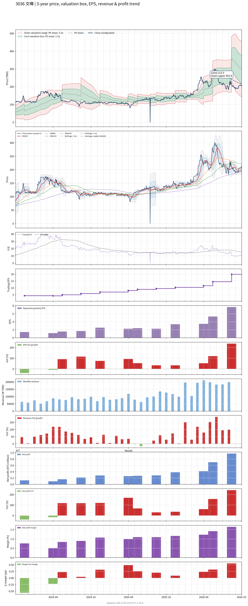

# 3036 - 文曄

## 業務簡介
**板塊:** Technology
**產業:** Electronic Components
**市值:** 273,806 百萬台幣
**企業價值:** 301,794 百萬台幣

文曄科技 ([[WT Microelectronics]]) 為全球前四大半導體零組件通路商，與  並列台灣通路雙雄。2024 年以 38 億美元完成對加拿大通路商 [[Future Electronics]] 之併購案，成功打入歐美工控與車用市場。

代理產品線極廣，涵蓋類比、混合訊號、功率元件、微控制器等，主要代理 [[TI]]、[[STMicroelectronics]]、[[Renesas]]、、、[[Skyworks]]、[[ON Semiconductor]] 等國際大廠。服務超過 25,000 家全球客戶。

## 供應鏈位置
**上游 (半導體原廠):**
- **類比/功率:** [[TI]]、[[STMicroelectronics]]、[[ON Semiconductor]] — 類比 IC、[[MOSFET]]
- **微控制器:** [[Renesas]]、[[STMicroelectronics]] — MCU
- **射頻/網通:** 、、[[Skyworks]] — 射頻與網通晶片

**中游 (通路代理與技術服務):**
- **亞太通路:** **文曄** (亞太區半導體代理)
- **歐美通路:** [[Future Electronics]] (歐美工控/車用代理)
- **技術支援:** **文曄** (設計導入與供應鏈管理)

**下游 (EMS/ODM 與終端品牌):**
- **EMS/ODM:**  (最大客戶)、、 — 代工廠採購
- **手機品牌:** 、中國手機品牌
- **車用/工控:** 歐美工控與車用大廠 — 透過 [[Future Electronics]] 服務

## 主要客戶及供應商
### 主要客戶
- **EMS/ODM:**  (最大客戶)、、 — 半導體零組件採購
- **手機品牌:** 、中國手機品牌
- **車用/工控:** 歐美工控與車用大廠 — 透過 [[Future Electronics]]

### 主要供應商
- **核心代理原廠:** [[TI]]、[[STMicroelectronics]]、[[Renesas]]、、、[[Skyworks]]、[[ON Semiconductor]]

## 財務概況 (單位: 百萬台幣, 只有 Margin 為 %)
### 估值指標 (股價 $215.50 as of 2026-10-07 | TTM 截至 2026-06-30 | Forward 預估至 2026-12-31)
| P/E (TTM) | Forward P/E | P/S (TTM) |  P/B | EV/EBITDA |
|-----------|-------------|-----------|------|-----------|
|     11.23 |        6.91 |      0.16 | 2.20 |      8.51 |

### 年度關鍵財務數據 (近 3 年)
|                         |   2025-12-31 |   2024-12-31 |   2023-12-31 |
|:------------------------|-------------:|-------------:|-------------:|
| Revenue                 |   1177948.91 |    959431.90 |    594518.81 |
| Gross Profit            |     47623.83 |     37602.07 |     18406.26 |
| Gross Margin (%)        |         4.04 |         3.92 |         3.10 |
| Selling & Marketing Exp |     19393.04 |     16573.83 |      6383.29 |
| R&D Exp                 |       810.44 |       850.59 |       755.45 |
| General & Admin Exp     |      5898.18 |      4815.20 |      3059.84 |
| Operating Income        |     21522.18 |     15362.45 |      8207.68 |
| Operating Margin (%)    |         1.83 |         1.60 |         1.38 |
| Net Income              |     13543.72 |      9112.16 |      4012.14 |
| Net Margin (%)          |         1.15 |         0.95 |         0.67 |
| Op Cash Flow            |       -    |       -    |       -    |
| Investing Cash Flow     |       -    |       -    |       -    |
| Financing Cash Flow     |       -    |       -    |       -    |
| CAPEX                   |       -    |       -    |       -    |

### 季度關鍵財務數據 (近 4 季)
無可用數據。
## Chart

